# ass_os_worksheet2_part1_V2

# README.md - Worksheet 2 (Part 1: Tiny OS Bootloader, Calling C, Framebuffer Driver)

Operating Systems - UFCFWK-15-2  
Worksheet 2 - Part 1  
Student: Omran2.omran@live.uwe.ac.uk

## **1\. Overview**

This submission implements Tasks 1-3 of Worksheet 2 Part 1, following The Little Book of OS Development and the worksheet instructions.  
The learning goals, as stated in the brief, are to understand:

- Booting a machine from scratch
- Calling C from assembler
- Developing a framebuffer driver for output

This README documents:

- Repository structure
- Build/run instructions (Task 1-3)
- How each component works
- Screenshots demonstrating correctness

# **2\. File/Directory Structure**

The worksheet repository includes three tasks, each self-contained with its own source/, iso/, and in later tasks, drivers/ and Makefile.

ass_os_worksheet2_part1_V2/

│

├── README.md

├── screenshots/

│

├── Task_1/

│ ├── iso/

│ └── source/

│

├── Task_2/

│ ├── iso/

│ ├── Makefile

│ └── source/

│

└── Task_3/

├── drivers/

├── iso/

├── Makefile

└── source/

# **3\. Cloning the Worksheet Repository**

### **Command**

git clone <https://gitlab.uwe.ac.uk/o2-omran/ass_os_worksheet2_part1_v2.git>

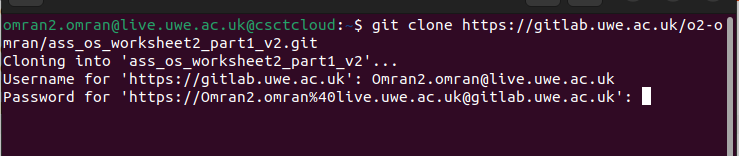
**Screenshot: Git Authentication**

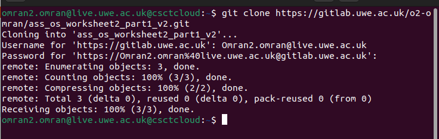
 **Screenshot: Repository Cloned**

The repository is also publicly available from:

https://github.com/Omran503/ass_os_worksheet2_part1.git

# **4\. Task 1 - Minimal Bootloader (Write 0xCAFEBABE to EAX)**

This task implements the smallest possible OS:  
A kernel that boots via GRUB Legacy, is loaded at 1 MB, and writes the 32-bit magic constant:

0xCAFEBABE

to the EAX register.

This corresponds to the worksheet requirement:

"As requested, we will begin with developing the smallest operating system possible, the one thing this OS will do is write 0xCAFEBABE to the eax register!"

## **4.1 Navigating Into Task 1**

cd Task_1

ls

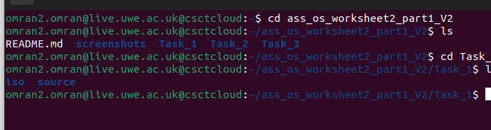 

**Screenshot**

## **4.2 Assembling and Linking the Kernel**

Task 1 is built manually (no Makefile required).

### **Assemble loader.asm**

nasm -f elf source/loader.asm -o source/loader.o

### **Link using the provided linker script**

ld -T source/link.ld -melf_i386 source/loader.o -o iso/boot/kernel.elf

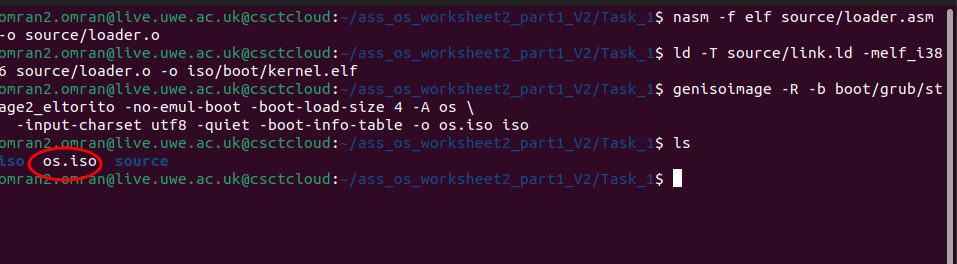 

**Screenshot**

This follows the worksheet instructions:

We are now ready to link our executable… using ld with the custom linker script.

## **4.3 Creating the GRUB-bootable ISO**

### **Command**

genisoimage -R \\

\-b boot/grub/stage2_eltorito -no-emul-boot \\

\-boot-load-size 4 -A os -input-charset utf8 -quiet \\

\-boot-info-table -o os.iso iso

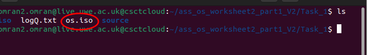 
**Screenshot: ISO created**

This matches the worksheet's required command.

## **4.4 Running the Kernel With CPU Logging (QEMU)**

### **Command**

qemu-system-i386 -nographic -boot d -cdrom os.iso -m 32 -d cpu -D logQ.txt

 

**Screenshot: GRUB menu**

## **4.5 Verifying EAX = 0xCAFEBABE**

Terminate QEMU with CTRL-C, then inspect the trace:

tail -n 20 logQ.txt

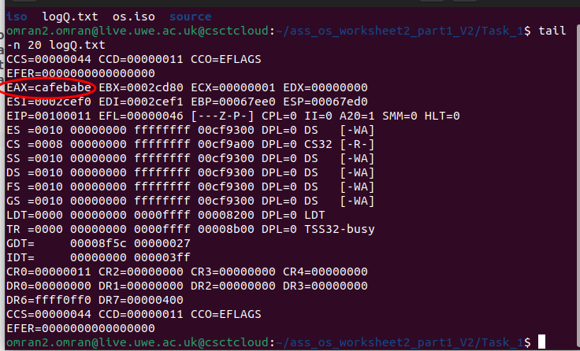 
**Screenshot**

Search explicitly:

grep "cafebabe" logQ.txt

 
**Screenshot**

Task 1 successfully completed.

# **5\. Task 2 - Calling C From Assembly**

Task 2 adds:

- Transition from assembly to  C 
- Calling sum_of_three() from the textbook
- Implementing two additional C functions of our choice (sum_array and  find_max)
- Verifying correctness using QEMU CPU traces

## **5.1 Navigating Into Task 2**

cd Task_2

ls

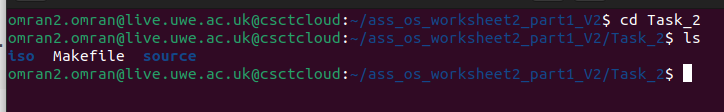
 

**Screenshot**

## **5.2 Building Task 2**

### **Command**

make

**Screenshot**

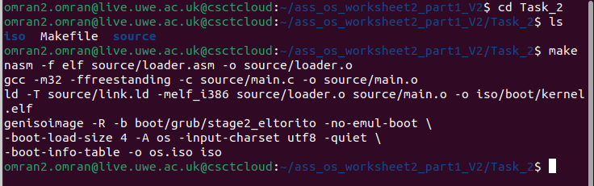 

## **5.3 Booting Task 2 Kernel**

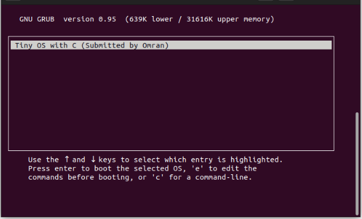 

**Screenshot: GRUB Entry**

## **5.4 C Functions Implemented**

### **1\. sum_of_three(10, 20, 30)**

Expected output: 60 → hex 0x0000003C

### **2\. sum_array()**

Input array: {5, 12, 7, 25, 3}  
Sum: 52 → hex 0x00000034

### **3\. find_max()**

Maximum: 25 → hex 0x00000019

## **5.5 Verifying via logQ.txt**

### **sum_of_three() → 0x3C**

grep "EAX=0000003C" logQ.txt

 **Screenshot**

### **sum_array() → 0x34**

grep "EAX=00000034" logQ.txt

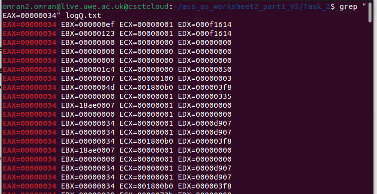

 **Screenshot**

### **find_max() → 0x19**

grep "EAX=00000019" logQ.txt

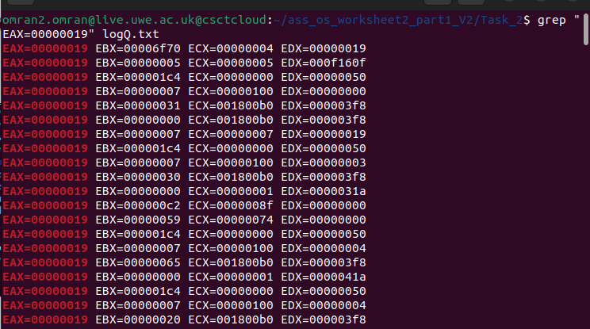

 **Screenshot**

Task 2 completed successfully.

# **6\. Task 3 - Framebuffer Driver (VGA Text Mode)**

This task implements:

- VGA memory-mapped framebuffer
- Text rendering using color attributes
- Cursor movement API
- Scrolling
- Number printing
- QEMU curses mode runtime + Telnet shutdown

The driver code is put in the drivers director with functions for cursor position, printing strings, numbers, clearing, colours, etc."

## **6.1 Navigating Into Task 3**

cd Task_3

ls

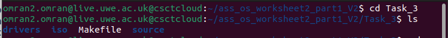

**Screenshot**

## **6.2 Building Task 3**

### **Command**

make

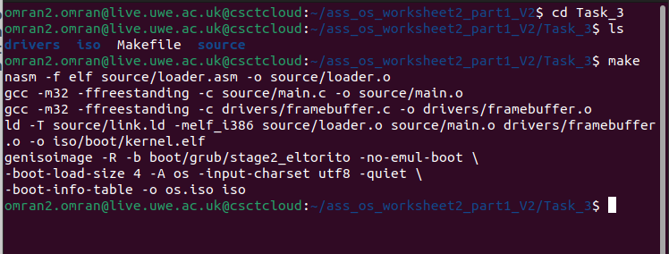

**Screenshot**

## **6.3 Running Without Curses**

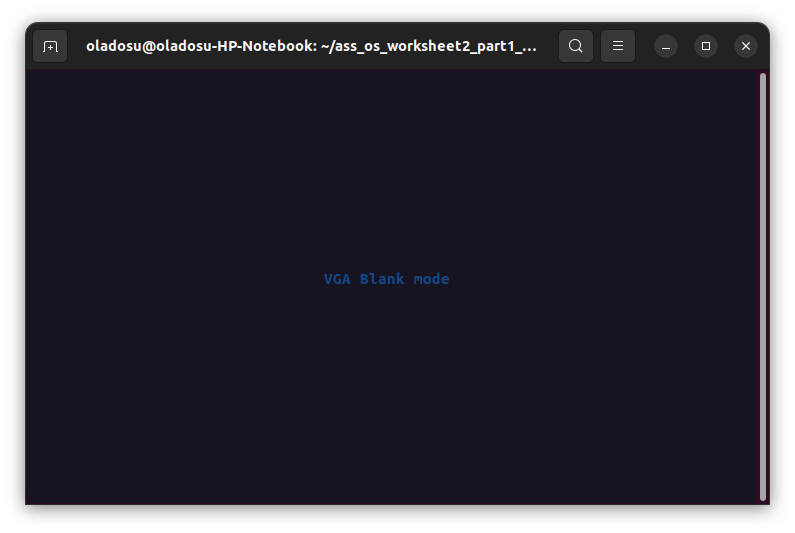
**Screenshot: Blank VGA mode**

## **6.4 GRUB Menu for Framebuffer Kernel**

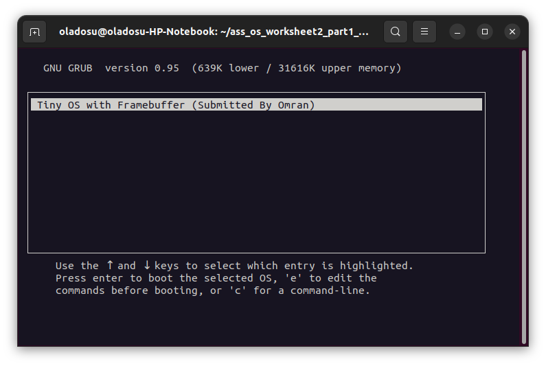

### **Screenshot**

## **6.5 Framebuffer Output**

The kernel exercises:

- fb_clear()
- fb_write_string()
- fb_move_cursor()
- fb_write_number()

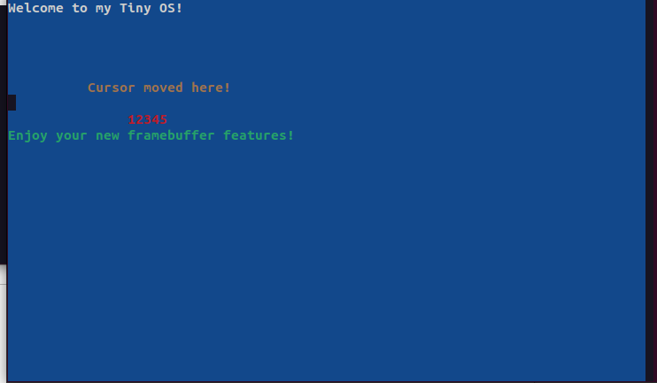

**Screenshot: Rendered output (coloured text, cursor, number printing)**

The framebuffer API works correctly and matches the worksheet requirement:

Support printing strings, numbers, setting colours, clearing the framebuffer.

## **6.6 Running QEMU in Curses Mode**

The worksheet requires curses mode:

### **Command**

qemu-system-i386 -curses \\

\-monitor telnet::45454,server,nowait \\

\-serial mon:stdio \\

\-boot d -cdrom os.iso \\

\-m 32 -d cpu -D logQ.txt

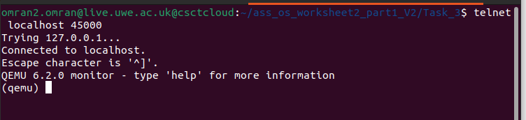
**Screenshot**

## **6.7 Using Telnet to Stop QEMU**

### **Connect**

telnet localhost 45454

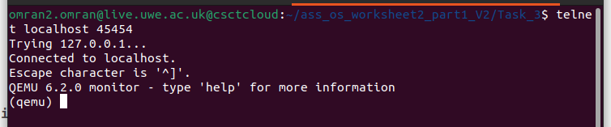
**Screenshot**

### **Quit**

(qemu) quit

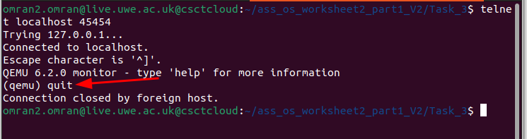

**Screenshot**

## **6.8 Final CPU Trace**

### **Command**

tail -n 20 logQ.txt

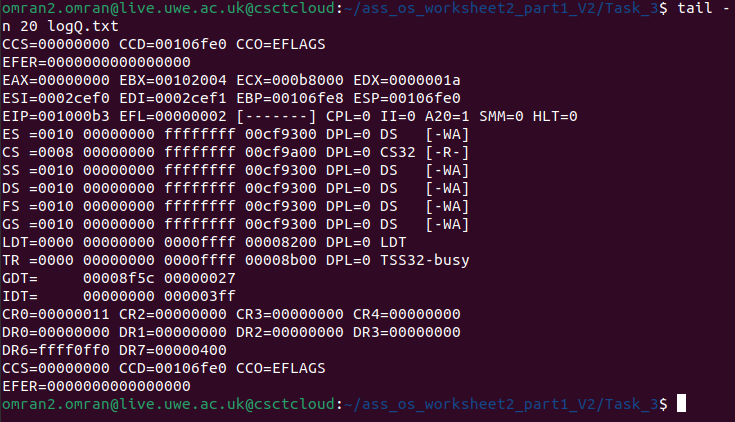

**Screenshot**

Confirms framebuffer code executed correctly.

# **7\. Conclusion**

This submission successfully completes all required components of the worksheet. 
Task 1 provides a minimal operating system that boots correctly and displays the 
hexadecimal value **0xCAFEBABE**, confirming successful control transfer from the 
bootloader to the kernel. Task 2 extends the system by enabling calls from assembly 
into C, implementing and validating three separate C functions to demonstrate correct 
interoperability between the two languages. Task 3 delivers a fully functional 
framebuffer driver capable of rendering text, handling colours, moving the cursor, 
printing numbers, and supporting automatic scrolling, thereby establishing a complete 
text-mode output subsystem. Finally, Task 4 includes full documentation with clear 
explanations and screenshots, providing evidence of correct implementation across 
all tasks.

## **End of README.md**

.
